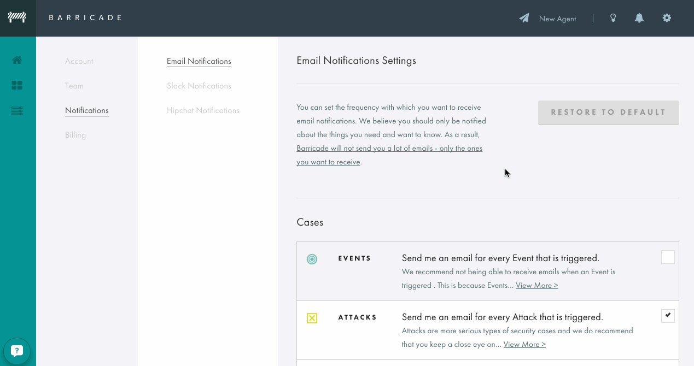

+++
date = "2015-08-04"
title = "Email Notification Controls"
description = "Changelog - Email Notification Controls"
url = "changelog/email-notifications"
section = "changelog"
category = "app"
weight = "06"

+++

You can now manage your email notification through the Barricade app settings, to opt-in and opt-out of different levels of security notifications.

By default, you will receive notifications for **Incidents** - our most serious security classification. For more insight into the things Barricade observes, you can enable Alerts and Events - but doing so will typically result in a lot more notifications from common, low-level issues.

We **do not recommend** you opt-out of Incident notifications!

You'll find the new controls in the app: Settings > Notifications > [Email Notifications](https://app.barricade.io/dashboard/settings/notification/email)

Note that the ability to manage notifications is **limited to account admins** - if you have been added to a team, your account is read-only. You'll need to contact the account owner.