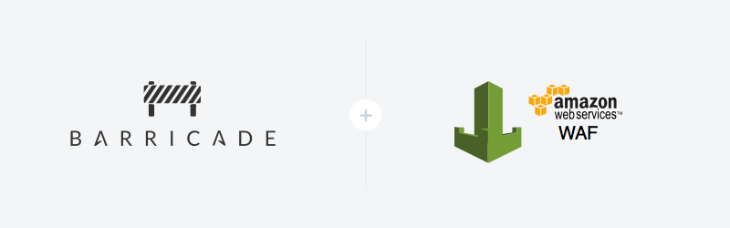
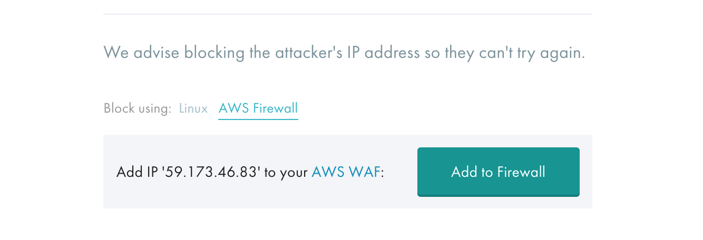

+++
date = "2015-10-09"
title = "Added AWS Web App Firewall integration"
description = "Changelog - Added AWS Web App Firewall integration"
url = "changelog/aws-waf"
section = "changelog"
category = "app"
weight = "15"

+++

Now you can use [AWS WAF](https://aws.amazon.com/waf/) & [Barricade](https://barricade.io/features) together to make an **intelligent** and **learning** firewall.

You'll find a new section in the app to [add the integration here](https://app.barricade.io/dashboard/settings/integration/aws_waf), which will add a simple 'Add to Firewall' button to security cases that we detect. 

For more details on using the integration, see our [documentation](../../using-barricade/#aws-waf-integration), or check out [our blog announcement](https://blog.barricade.io/introducing-our-new-amazon-web-application-firewall-integration/) - or just go ahead and [try it out for yourself](https://app.barricade.io/dashboard/settings/integration/aws_waf).