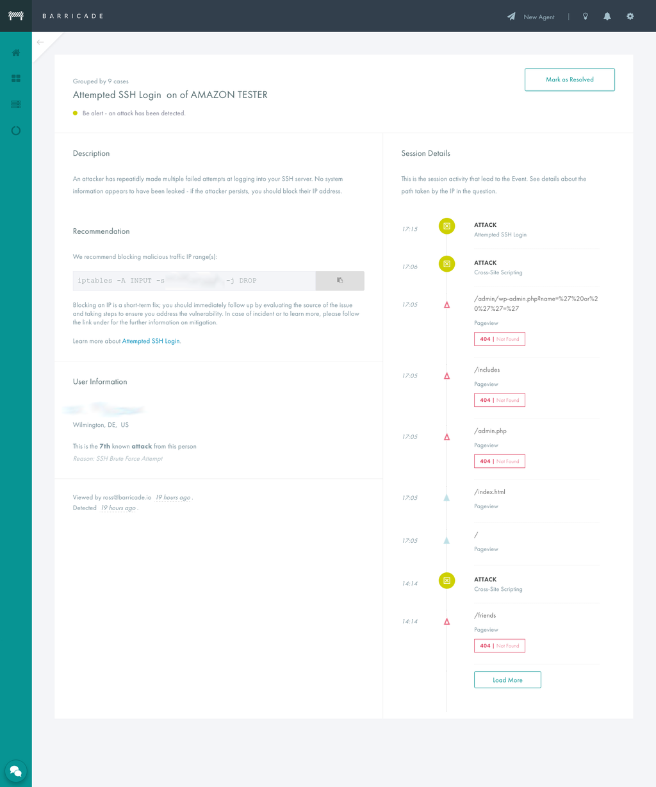
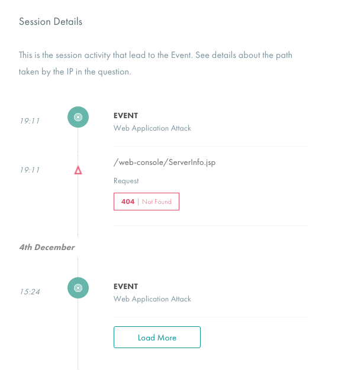

+++
date = "2015-12-07"
title = "Introducing the App Security Story"
description = "Changelog - Introducing the App Security Story"
url = "changelog/app-security-story"
section = "changelog"
category = "app"
weight = "21"

+++

We're very happy to reveal a big change to how we present details of events, attacks and incidents; the **Security Story** - designed to improve your visibility into your Application Security.

### The Session Timeline

Case details will now include a **timeline** of the attacker's behavior, including:

*   page requests
*   endpoint requests
*   application errors

This information is presented alongside the case details and recommendations, to provide greater context to you and your team

Now you can see wider **activity** and the **route** that that attacker has taken through your system - so you can spend less time digging through server logs, and get more visibility into issues, to better understand where a particular vulnerability originated in your app.

### Attacker Profile

We've also added information to help you **profile** the behavior of attackers over time, so that you're not just seeing the requests they make; but also patterns in their behavior.

_We're excited about this - we will continue to bring new user-friendly features to help you organize, filter and browse insights into your application security._  

--

The changes are now live in the app - [view a Case page](https://app.barricade.io/dashboard/overview) to see it in action.

### Feedback
We're hoping you'll find this information as useful as we do; let us know if you've got any feedback on this new approach [we'd love to hear from you](https://barricade.io/about/#contact-info).